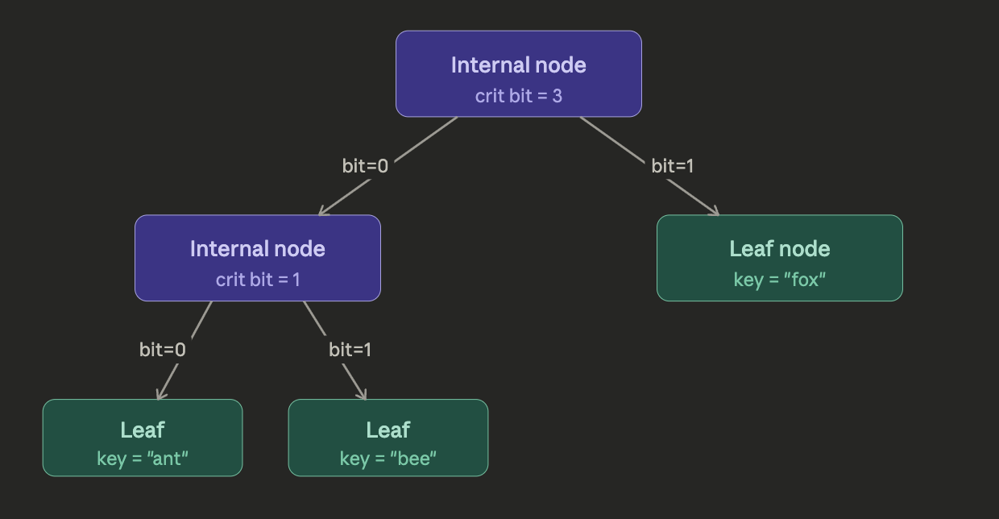

A critbit tree is a tree data structure for storing and searching sets/maps of strings (or fixed‑width integers) by looking at their bits instead of doing full string comparisons on every step

high level

- think of each key (string or integer) as a sequence of bits
- whenever two keys differ, there is a first bit position where they differ – that’s the critical bit (the “crit bit”)
- internal nodes in a critbit tree store: index of critical bit and two child pointers ( one for keys where that bit is 0, one for keys where it’s 1.)

crit-bit tree has exactly two node kinds: 
    - internal nodes (store a critical bit index and two children) 
    - external nodes (leaves, store the actual key)
